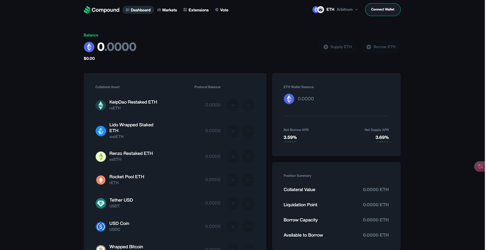
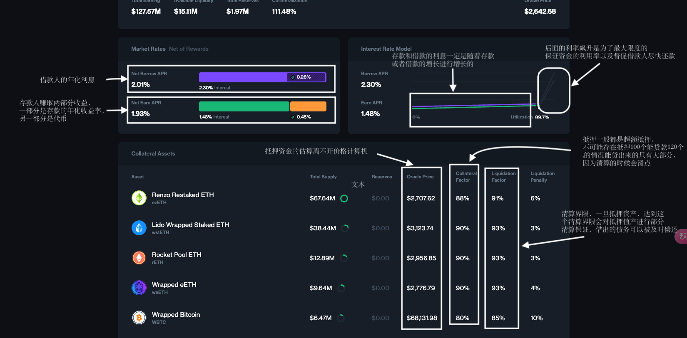
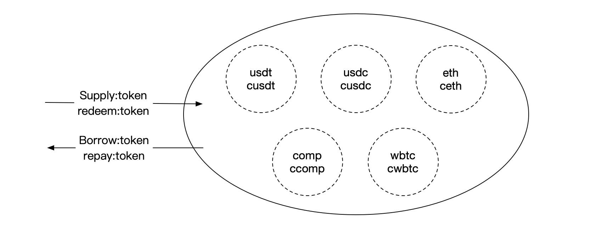
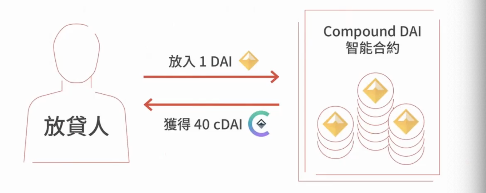
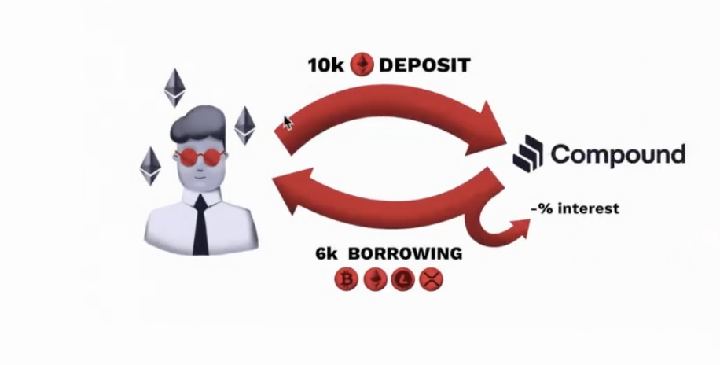
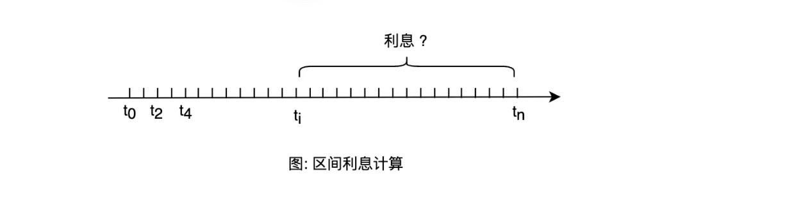
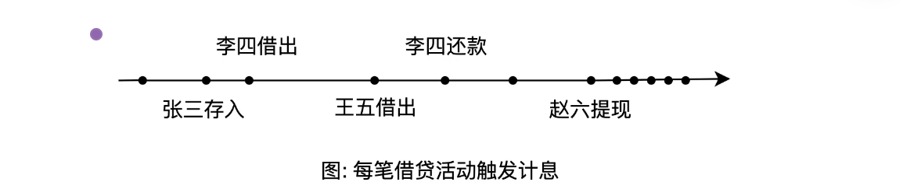
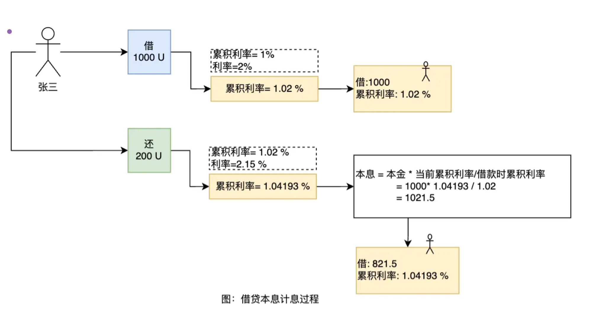
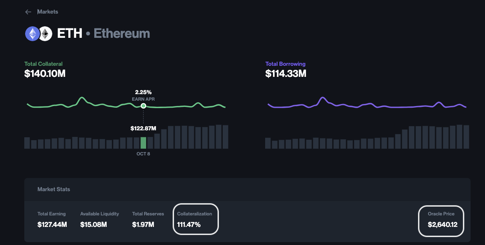

# Compound

## 1.什么是Compound

一个去中心化金融提供借款和贷款的协议





## 2.工作原理

- 存款人：存款 -> 赚取收益和代币挖矿
- 借款人：超额抵押 -> 借款 -> 支付利息



### 细节展示

#### 存款人/放贷人

- Deposit ETHs -> Earning ETH interest
 
```
function supply(address asset,uint amount)
```
 

#### 借款人

- Collateral  10K (ETH,USDT,DAI) asset
    -> Borrow 6K WBTC  asset
    -> pay WBTC interest
    
    

### 利息计算
#### 复利

计算复利是定期将累积的利息与现有本金合计，然后计算新本金的利息。新的本金等于初始本金加上累积的利息。复利经常按每年、每半年、每季度、每月等定期计算。

设初始本金 `P`，年利率 `R`，时长`T`（单位:年），每年复利次数 `N`，则到期复利金额 `$A` 计算公式如下: 
$A=P(1+ \frac{R}{N})^{NT}$ ,
`A`是初始本金与累计利息之和。如果每年复利一次，公式可简化为：
$A=P(1+R)^T$

#### 浮动利率

在区块链借贷协议中，大部分采用复利方式计算利息，但并非固定利率，而是浮动利率。即每次复利计息时所使用的利率是根据市场借贷供关系决定的。因此，我们并不能使用固定利率公式计算复利，只能根据利率滚动计算，公式如下：
    $A_{t+1} = A_t(1 + R_{t+1})$

- A<sub>t+1</sub> 表示 t+1时的复利额
- A<sub>t</sub> 表示t时的复利额，是t+1复利计息时的新本金
- R<sub>t+1</sub>是在t+1时刻计算出的利息，表示从t到t+1时间段内的区间利息

因此可推导出：
  $A_{t+1} = A_1(1+R_1)(1+R_2)(1+R_3...(1+R_{t+1})$ 
$=P(1+R_1)(1+R_2)(1+R_3)...(1+R_{t+1})$

#### 一段时间的利息计算
不是所有人都是从 0 时刻开始借款，而是在一个不确定的时刻借走的，复利计算时需要知道一段时间的利率是多少。假如在$t_i$时刻借走100万U，在 $t_n$时刻还款时连本带息应还多少？



根据上面的推导公式可推导**出应还本息公式**：

$A = P(1+R_i)(1+R_{i+2})...(1+R_{n-1})(1+R_n)$ 
$= P\frac{(1+R_1)(1+R_2)(1+R_3)(1+R_4)(1+R_5)...(1+R_{t+1})}{(1+R_1)(1+R_2)...(1+R_{i-1})(1+R_i)}$

把$(1 + R_1)(1 + R_2)...(1 + R_t)(1 + R_{t+1})$称之为t+1时的**累积利率**$R_{t+1}$,则有：
$A=P\frac{R_{t+1}}{R_i}$

计算本息时只需要知道**借款**和**还款时**的**累积利率**，便可计算出本息额。减去借款本金，剩余部分为借款应付利息。


### Compound协议计息方式

有人存款、借款、还款、提现、清算时都会先执行一次计息。这相当于不定时的复利，复利频次由市场活跃度决定。


每笔借贷触发计息，在计息时只需要存储当前的累积利率，累积利率在`Compound`中被称之为 `BorrowIndex`。`Compound`计息方法在合约中比较冗余，下方是简化版代码:

```
function accrueInterest(){
 	
  var currentBlockNumber = getBlockNumber(); //获取当前区块高度
  //如果上次计息时也在相同区块，则不重复计息。
  if (accrualBlockNumber == currentBlockNumber) {
      return NO_ERROR;
  }
  
  var cashPrior = getCashPrior();  //获取当前借贷池剩余现金流
  //根据现金流、总借款totalBorrows、总储备金totalReserves 从利率模型中获取区块利率
  var borrowRateOneBlock = interestRateModel.getBorrowRate(cashPrior, totalBorrows, totalReserves);  
 	// 计算从上次计息到当前时刻的区间利率
  var borrowRate=borrowRateOneBlock*(currentBlockNumber - accrualBlockNumber);
 	// 更新总借款，总借款=总借款+利息=总借款+总借款*利率=总借款*（1+利率）
  totalBorrows = totalBorrows*(1+borrowRate);
  // 更新总储备金
  totalReserves =totalReserves+ borrowRate*totalBorrows*reserveFactor;
  // 更新累积利率：  最新borrowIndex= 上一个borrowIndex*（1+borrowRate）
  borrowIndex = borrowIndex*(1+borrowRate);
  // 更新计息时间
  accrualBlockNumber=currentBlockNumber;
  return NO_ERROR;
}

```
最核心部分是`borrowIndex`累积利率的更新计算，在合约中始终记录着最新累积利率。当用户借款时，将存储用户借款金额和此刻的累积利率。如下图演示的是借贷时的计息过程。


当张三第一次借出1000 U 时，先更新累积利率从1%更新到 1.02%，然后在账簿上记录张三借款本金1000和此时刻的累积利率 1.02%。一个小时后，张三还入200U。假设这一小时没有其他借贷发生，这一小时的借款利率是2.15%，累积利率更新成 1.04193%。根据当前的累积利率计算出张三的借款本息为 1021.5 U 。最后，除去200U还款，更新账簿上张三新的借款本金为 821.5 U，并同步更新累积利率。

Compound就是通过这种简单方式维护着借款账簿，只需维护好累积利率，便可实时的追踪每位借款人的本息

### 资金使用率的计算

- UtilizationRate（利用率） = borrows(借出资金) /(cash（当前余额） + borrows（借出资金） - reserves（储备金）)
- Borrow Rate（借款利率）= baseRate（基础理率） + utilizationRate * multiplier（斜率）
- Supply Rate（存款利率）= Borrow Rate * utilizationRate* （1 - reserves factor）


### 借款

#### 计算公式



- Collateral Value (抵押金额) / Borrow Value（借款金额）>= Collateralization （抵押率）
- Collateral Value (抵押金额) = Supply * Asset Oracle Price
- Borrowing Value = Borrowing amount * Asset Oracle Price

