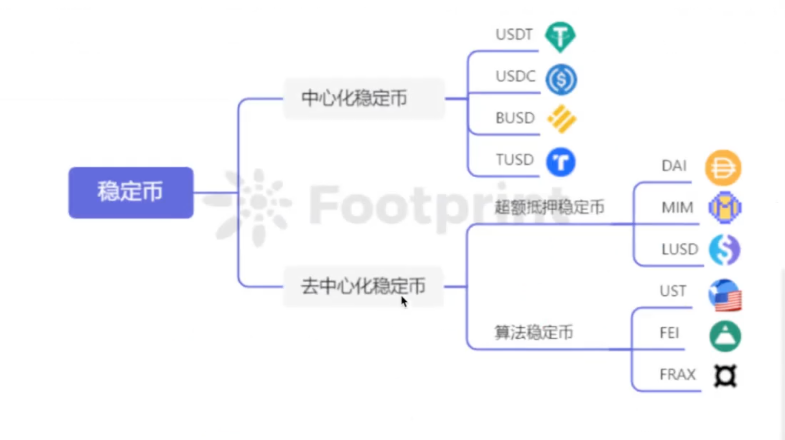
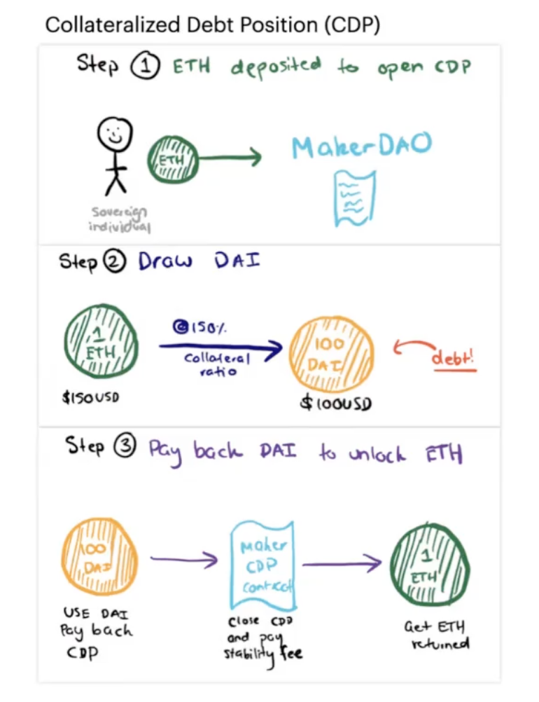
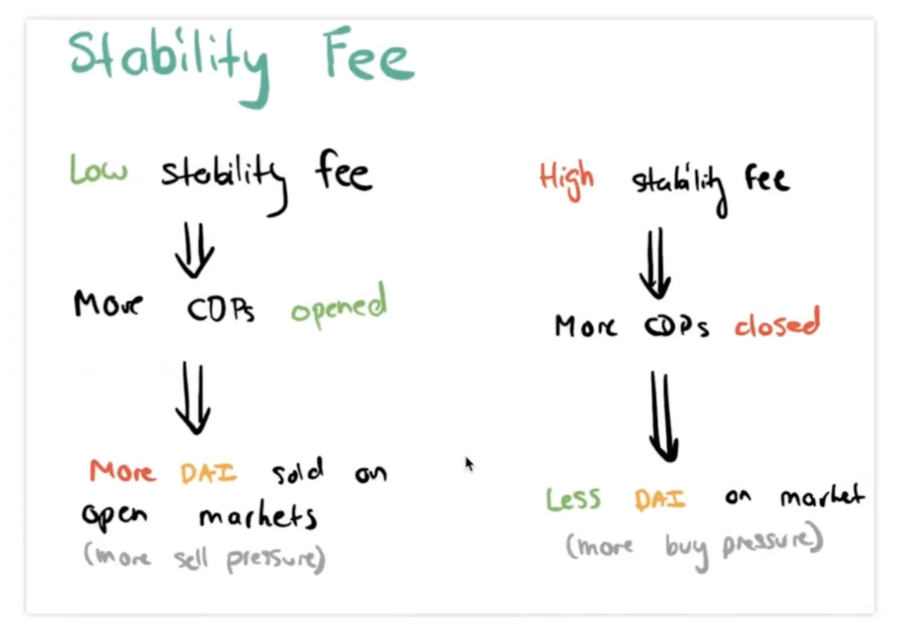

# DAI稳定币介绍

## 1.什么是稳定币

稳定币是一种加密货币，其中数字资产的价值应该与参考资产挂钩，即法定货币。

理论上，参考资产的1:1支持可以使稳定币值跟踪挂钩的价值，而不受许多数字资产市场中常见价值的根本变化的影响。 然而，在实践中，稳定币发行者尚未被证明保持足够的储备以支持稳定价值。

## 2.工作原理

- 1.将`ETH`存入`MakerDAO`的合约中去
- 2.根据超额抵押利率计算得到多少的`DAI`
- 3.将借出的`DAI`加上稳定费一并归还，可以赎回原来的`ETH`

通过调节稳定费来促进借出和还贷。

