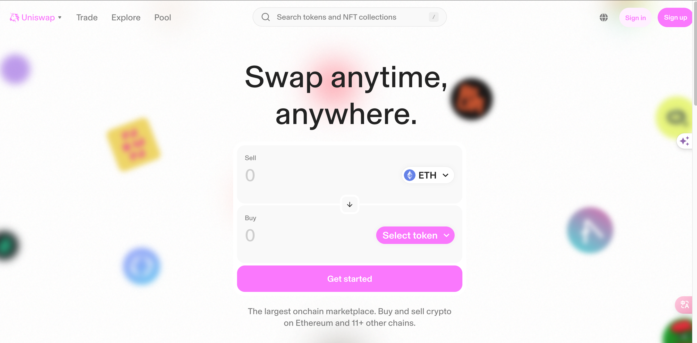
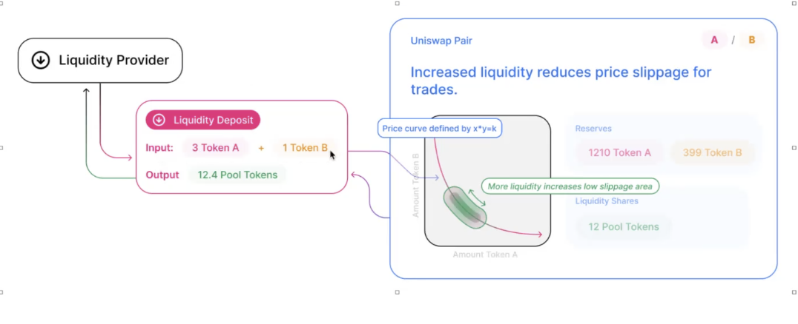
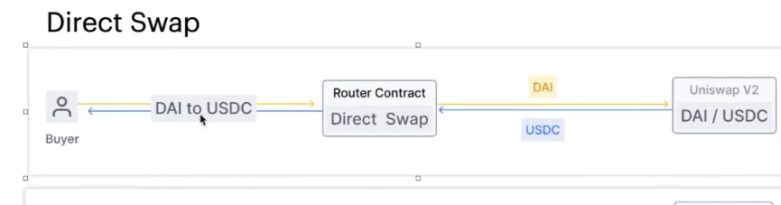
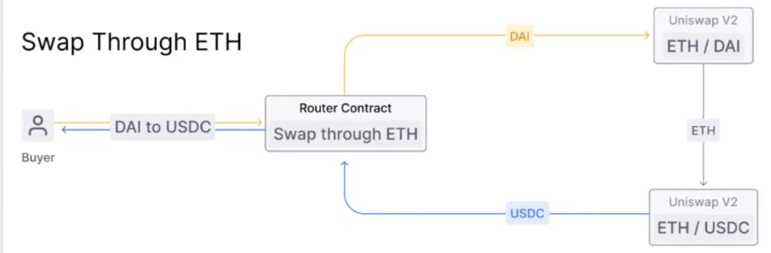

## Uniswap 

## 1. 什么是Uniswap
  `Uniswap`协议是一个点对点系统，旨在在[以太坊](https://ethereum.org/)区块链上交换加密货币（[ERC-20Token](https://ethereum.org/en/developers/docs/standards/tokens/erc-20/)）。该协议是作为一组持久的、不可撤销的智能合约实现的;旨在优先考虑审查阻力、安全性、自我保管，并且在没有任何可选择性限制访问的可信中介的情况下运行。
  
  `Uniswap`协议目前有`三`个版本。`V1`和`V2`,`V3`都是开源的
  
### 1.1 相关链接
[v1白皮书](https://hackmd.io/@HaydenAdams/HJ9jLsfTz#%F0%9F%A6%84-Uniswap-Whitepaper)
[v2白皮书](https://app.uniswap.org/whitepaper.pdf)
[v3白皮书](https://app.uniswap.org/whitepaper-v3.pdf)
  
  
[v1中文版白皮书 ](./tmp/Uniswap%20白皮书.pdf) 
[v2中文版白皮书](./tmp/Uniswap%20v2%20白皮书.pdf)
[v3中文版白皮书](https://y1cunhui.github.io/uniswapV3-book-zh-cn/)  

### 1.2 项目如何管理/如何治理
Uniswap协议是由`UNI`代币持有者拥有和管理的公共产品。并且会在[治理论坛](https://gov.uniswap.org/)中向社区征询意见，进行一系列流程后形成治理提案，拥有一定数量代币的用户可对提案进行投票，投票通过的提交到链上进行更改。

## 2. 项目地址
[uniswap的网站地址](https://app.uniswap.org/)

## 3. 解决了什么问题
解决了在以太坊上不同数字货币的兑换需求

## 4. 如何解决的
`Uniswap`采用的自动做市模型是**恒定乘积做市商模型**，其公式是 `X*Y=K`，其中`X`和`Y`是两种 `ERC20`代币的数量，`K`是常数。自动做市需要一个`流动池（Liquidity Pool）`，这个流动池的提供者是`流动性提供商(Liquidity Provider)`。
流动性提供者向`Uniswap`池中添加流动性时，它需要提供与当前市场类似的兑换比率。
流动性提供商的收入来自于交易费用，这些交易费用会按比例分配给流动性的提供商。

### 4.1 实现原理图示
以`Uniswap V2`为例，

### 4.2 v1,v2,v3版本间的区别及改进

#### 4.2.1 Uniswap_v1
利用工厂/注册合约，为每个`ERC20`代币部署单独的交换合约。这些交易合约同时持有`ETH`和关联的`ERC20`代币构成的准备金。这可以实现两个基于相关供应的交易对之间的交易。交易合约通过注册表串联在一起，从而可以使用`ETH`作为媒介，实现`ERC20`代币之间的互相交易。

[代码链接地址](https://github.com/runtimeverification/verified-smart-contracts/blob/uniswap/uniswap/code/uniswap_exchange.vy)

#### 4.2.2 Uniswap_v2
在`v1`的基础上添加了几个特性。

- 最重要的一个是支持`ERC20代币/ERC20代币`交易对
     不像`v1`只支持`ERC20代币/ETH`交易对。
     
- 强化了价格预言
     在每个区块开始处累积两个资产的相对价格。这允许其他以太坊合约计算两个资产在任意时间区间上的`TWAP（时间加权平均价格）`价格。

- 快速互换（`flash swaps`）功能
     用户可以自由地接收资产并把他们用在链上的其他地方，只要在转账的最后支付（或返还）即可。

[代码链接地址](https://github.com/Uniswap/v2-core)

#### 4.2.3 Uniswap_v3
在`v2`的基础上添加了几个特性。

- 集中流动性 vs 分布流动性
    - V2：
在 `Uniswap V2` 中，流动性提供者（`LP`）将其资金均匀地分布在整个价格区间上（0 到 ∞），这意味着大量的资金没有被有效利用。`LP`提供的流动性会跨越整个价格范围，不论市场价格在哪里。

    - V3：
`Uniswap V3` 允许流动性提供者选择将流动性集中在某个特定的价格区间内（集中流动性）。这种机制极大提高了资金效率，`LP` 可以在他们认为最有可能进行交易的价格区间内提供流动性，从而提高了资本回报率（收益率）。因此，`LP` 能够通过更少的资金获得更多的交易费。

- `LP`的资金效率
    - V2：
    因为流动性在整个价格区间内被平均分布，实际市场价格的变动可能只会利用到极少部分的流动性池，这导致资本效率较低。

    - V3：
由于 `LP` 可以在一个特定的价格区间提供流动性，资本利用率大大提高。流动性越集中，资金效率越高，`LP` 可以获得更高的交易费用，尤其是在市场价格接近流动性集中区时

- 交易费用结构
    - V2：
    `Uniswap V2`只有一种固定的交易费用，通常为`0.30%`。

    - V3：
    `V3`引入了多种不同的交易费用层次，`LP`可以选择`0.05%`、`0.30%`或`1.00%`等多个费率。这使得`LP`可以根据不同的资产波动性和风险偏好选择不同的费用层次。稳定币对等低波动性资产可能选择较低费用层次，而高波动性资产对可能选择较高的费用层次
    
- 范围订单 (Range Orders)
    - V2：
    在`V2`中，流动性提供者没有原生的功能可以提供**“范围订单”**功能，即设置在特定的价格范围买入或卖出资产。

    - V3：
    `V3`允许`LP`在提供流动性时创建类似于限价订单的功能。`LP`可以通过在特定的价格范围内提供单边流动性来模拟买入或卖出行为。当市场价格进入该区间时，`LP`的一部分资产会被换成另一种资产，从而实现范围订单效果。

- 无常损失（Impermanent Loss）
    - V2：
    无常损失在`V2`中比较普遍，因为流动性是在整个价格区间分布的，导致`LP`的资产更容易受到价格波动的影响。

    - V3：
    由于流动性提供者可以在特定的价格区间提供流动性，`V3`允许`LP`更好地控制无常损失的风险。通过将流动性集中在价格波动较小的区域，`LP`可以降低无常损失的影响，但也意味着他们需要更加积极地管理和调整流动性区间。
    
- `NFT`作为`LP`头寸(Position)的表示
    - V2：
    在`V2`中，流动性提供者的头寸是通过标准的`ERC-20`代币（LP 代币）来表示，所有`LP`的头寸都是同质化的。

    - V3：
    `V3`通过 `NFT（非同质化代币）`来表示`LP`的头寸，因为每个`LP`的头寸都可能是在不同的价格区间，因此具有独特性。每个`NFT`都代表了特定区间内的流动性提供情况
    
-  `Oracle`改进
    - V2：
    `V2`引入了时间加权平均价格（`TWAP`）作为价格预言机，但使用起来相对复杂，并且容易受到闪电贷攻击等问题的影响。

    - V3：
    `V3`改进了预言机的设计，使其更加高效和安全。通过更频繁的价格更新，`V3`的价格预言机功能更加准确和可靠，降低了潜在的价格操纵风险     

[代码链接地址](https://github.com/Uniswap/v3-core)

## 5. 数字货币的交易形式
以`Uniswap v2`为例
### 直接兑换

用户直接通过`Uniswap`提供的路由合约（关于路由合约之后介绍）进行路由到`Uniswap V2`直接将A代币兑换成B代币。

### 间接兑换

用户直接通过`Uniswap`提供的路由合约（关于路由合约之后介绍）进行路由到`Uniswap V2`,`Uniswap V2`将A代币兑换成了C代币，再用C代币最终兑换成了期望兑换的代币B。间接兑换的好处就是让用户的利益最大化，即能够换取最大数量的(期望兑换货币)B代币。
 

